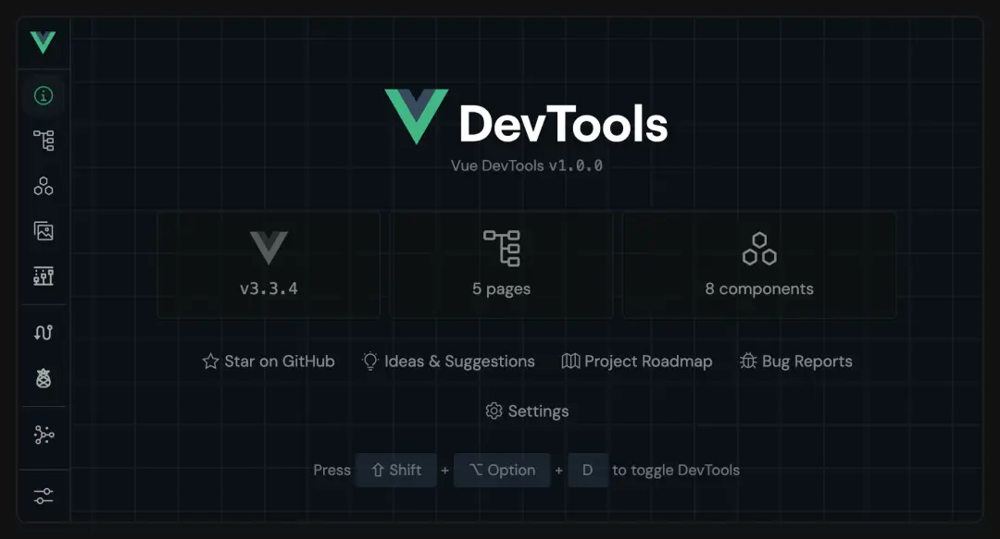
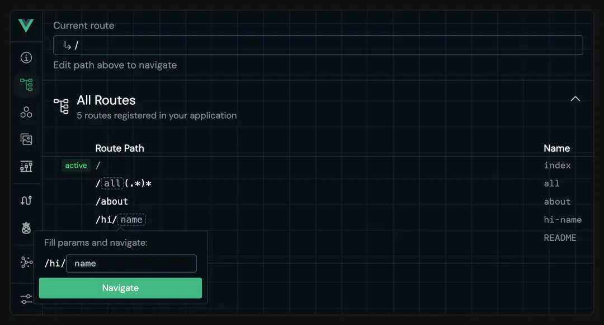
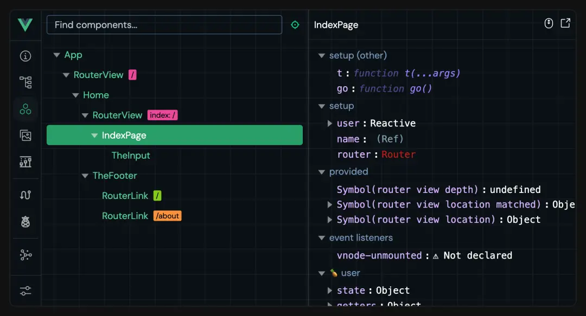
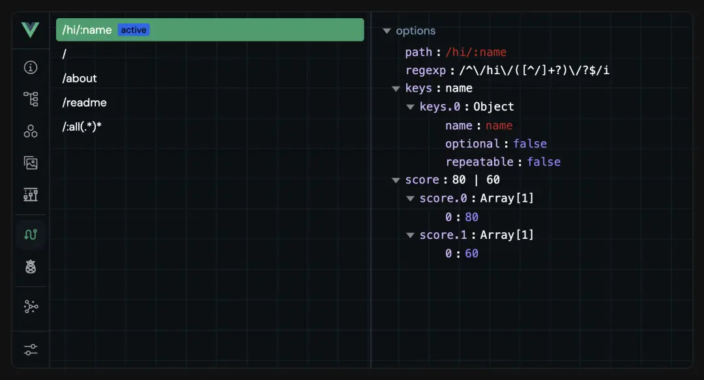
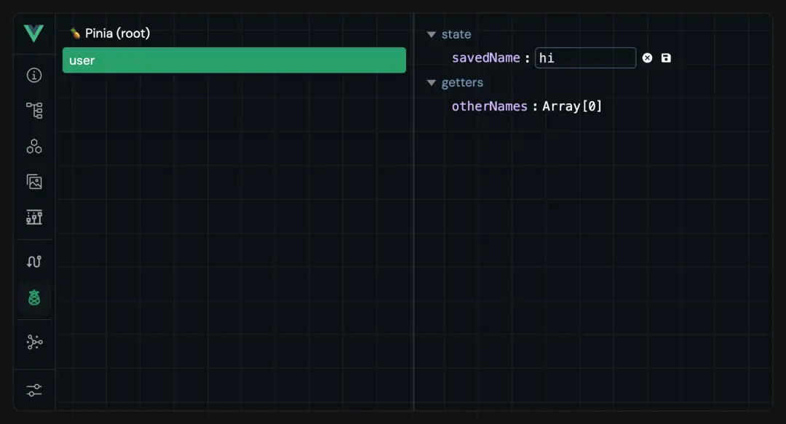
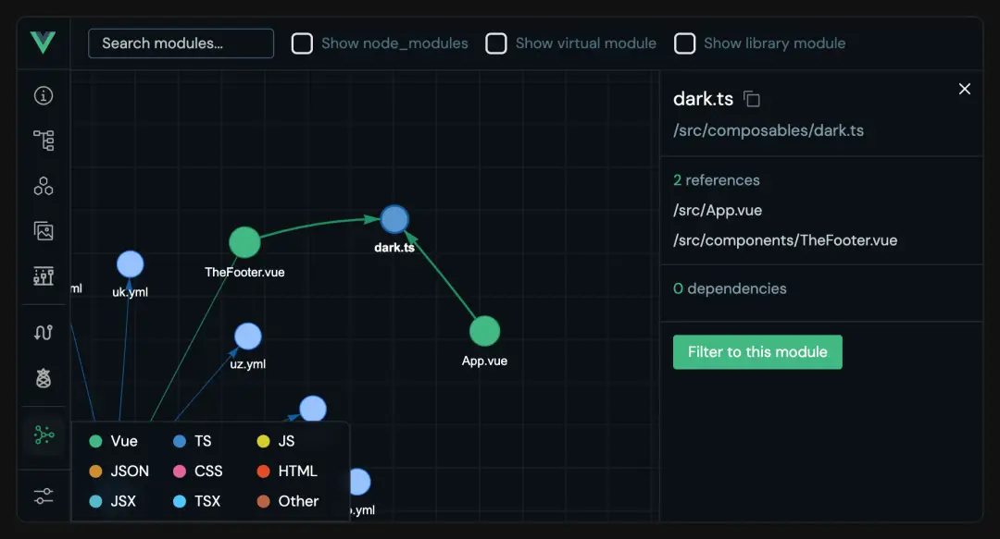
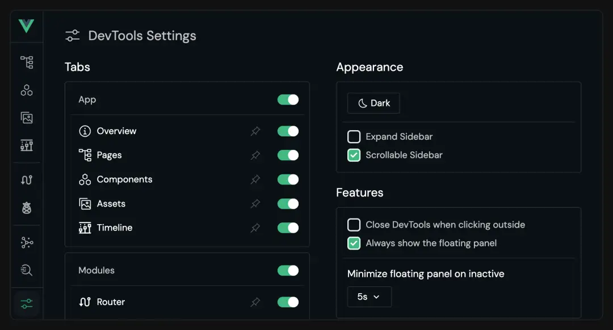

<div align="center">
  
  <h1>Vue3 Vite TS Base</h1>
</div>

## 简介

Vue3 Vite TS Base

- ⚡️ 使用 **Vite** ，ES驱动的前端开发与构建工具，实现真正的按需编译，即时更新。并获得更小的打包体积。
- 🆒 使用 **Vue3** 主流最新技术栈: `Vite + Vue3 + Pinia`
- 🐜 从 _ant-design-vue 3.x_ 版本升级到 **ant-design-vue 4.x** 版本，4.0+ 版本更新了*Flex* 弹性布局、*QRCode*二维码、_Watermark_ 水印、_Statistic_ 统计数值、_Tour_ 漫游式引导等全新组件。
- 🧪 使用 **原子 CSS** 框架: `Unocss`，优雅、轻量、易用
- 🍍 集成 **Pinia** 状态管理，支持状态持久化
- 📦 配合 **pnpm** 包管理器，提高效率
- ✈️ 使用 **unplugin** 系列自动导入工具`unplugin-auto-imports`、`unplugin-vue-components`
- 🔧 开发环境配置 **VueDevTools** 调试工具
- 📖 配置 **Eslint** 语法检查、**Prettier** 格式统一插件

## 使用方法

由于建议新一代 `pnpm` 包管理器，`package.json` 中已经使用 `engines` 将 `node` 版本指定为：

```
"node": ">=18 <=20",
"pnpm": ">=8 <=9"
```

### 安装依赖

```
pnpm i
```

或者

```
pnpm add
```

### 运行项目

1.开发环境

```
npm run dev
```

或者

```
pnpm run dev
```

2.测试环境

```
npm run dev:test
```

或者

```
pnpm run dev:test
```

3.生产环境

```
npm run dev:prod
```

或者

```
pnpm run dev:prod
```

### 打包项目

在 `vite.config.js` 中配置了打包输出文件夹名 `config.title + '-' + viteEnv.VITE_MODE + '-dist'` ,会生成以下项目名：
**当前项目名-当前环境-dist**
可自行修改

1.打包生产环境

```

npm run build
```

或者

```
pnpm run build

```

2.打包测试环境

```
npm run build:test
```

或者

```
pnpm run build:test
```

### 预览打包项目

启动一个本地的静态文件服务器，用于预览打包项目。这个服务器通常用来模拟生产环境的行为，帮助开发者测试构建后的应用程序。

```
npm run preview
```

或者

```
pnpm run preview
```

### 自动修复

可以自动修复 `.js` , `.vue` 文件中 `Eslint` 的格式错误

```
npm run lint:fix
```

或者

```
pnpm run lint:fix
```

## 文件目录

```

├── node_modules                                       # 安装后生成的依赖文件夹
├── public                                             # 静态资源
│   └──vite.svg                                        # vite图标（可以更换成项目logo）
├── src                                                # 源代码文件夹
│   ├── api                                            # 所有请求（要求按业务分文件夹）
│   ├── assets                                         # 静态资源
│   │   │── icons                                      # svg图标文件
│   │   │── images                                     # 图片文件（要求按公共/业务分文件夹）
│   │   └── styles                                     # 样式文件（要求按公共/业务分文件夹）
│   │       │── common                                 # 公共样式文件夹
│   │       │── variables                              # 全局变量文件夹
│   │       │   └──index.module.less                   # 全局变量样式文件
│   │       │── antd.less                              # antd主题样式文件
|   │       │── index.less                             # 全局样式文件
|   |       └── root.less                              # 根样式文件
│   ├── components                                     # 组件
│   │   │── base-components                            # 基础组件文件夹
│   │   │   └── base-button                            # 按钮
│   │   │   └── base-divider                           # 分割线
│   │   │   └── base-loading                           # loading
│   │   │   └── svg-icon                               # svg图标组件
│   │   └── business-components                        # 业务组件文件夹
│   ├── config                                         # 全局配置文件夹
|   │   │── constant                                   # 全局常量
│   │   │── custom-config.js                           # 用户自定义配置文件
│   │   │── default-config.js                          # 默认配置文件（network、setting、theme等）
│   │   └── index.js                                   # 全局配置入口文件
│   ├── dict                                           # 全局字典文件夹
│   │   └── index.js                                   # 全局字典入口文件
│   ├── directives                                     # 自定义指令文件夹
│   │   └── modules                                    # 指令模块文件夹
│   │       ├── copy.ts                                # 复制指令
│   │       ├── debounce.ts                            # 防抖指令
│   │       ├── draggable.ts                           # 拖拽指令
│   │       ├── throttle.ts                            # 节流指令
│   │       └── index.ts                               # 指令模块入口文件
│   ├── enums                                          # 枚举文件夹
│   │   └── httpEnum.ts                                # HTTP请求相关的枚举定义
│   ├── hooks                                          # 自定义 Hooks 文件夹
│   │   ├── index.ts                                   # Hooks 入口文件
│   │   ├── useDownload.ts                             # 下载相关的 Hook
│   │   └── useLoading.ts                              # 加载状态相关的 Hook
│   ├── layouts                                        # 页面布局
│   │   │── components                                 # 组件
│   │   │── index.vue                                  # 默认布局样式
│   │   └── MainLayout.vue                             # 全屏布局样式
│   ├── plugins                                        # vite插件文件夹
│   │   └── index.ts                                   # vite插件入口文件
│   ├── router                                         # 路由文件夹
│   │   ├── helper                                     # 辅助文件夹
│   │   │   ├── cacheRouter.ts                         # 缓存路由相关逻辑
│   │   │   ├── constant.ts                            # layout 布局相关常量
│   │   │   └── utils.ts                               # 工具函数
│   │   └── routes                                     # 路由模块文件夹
│   │   │   └── modules                                # 路由模块
│   │   │   │   └── index.ts                           # 路由模块入口文件
│   │   │   └── index.ts                               # 路由入口文件
│   ├── store                                          # Pinia状态管理文件夹
│   │   ├── interface                                  # 状态管理接口文件夹
│   │   └── modules                                    # Pinia状态模块文件夹
│   │   │   └── index.ts                               # Pinia状态模块入口文件
│   │   └── piniaPersist.ts                            # Pinia状态持久化配置
│   ├── typings                                        # 类型声明文件夹
│   │   ├── amap.d.ts                                  # 高德地图相关类型声明
│   │   ├── auto-imports.d.ts                          # 自动导入相关类型声明
│   │   ├── components.d.ts                            # 组件相关类型声明
│   │   ├── global.d.ts                                # 全局类型声明
│   │   ├── index.d.ts                                 # 类型声明入口文件
│   │   ├── plugins.d.ts                               # 插件相关类型声明
│   │   ├── router.d.ts                                # 路由相关类型声明
│   │   ├── svg-component-global.d.ts                  # SVG组件全局类型声明
│   │   └── svg-component.d.ts                         # SVG组件类型声明
│   ├── utils                                          # 工具类文件夹
│   │   ├── auto-import                                # 自动导入相关工具
│   │   │   ├── common.ts                              # 通用工具函数 (全局挂载函数)
│   │   │   └── pretty-log.ts                          # 美化日志输出工具
│   │   ├── browser                                    # 浏览器相关工具
│   │   ├── is                                         # 类型判断工具
│   │   │   ├── date.ts                                # 日期相关工具
│   │   │   ├── gpsChange.ts                           # GPS坐标转换工具
│   │   │   ├── index.ts                               # 工具入口文件
│   │   │   ├── mitt.ts                                # 事件总线工具
│   │   │   ├── request.ts                             # 请求相关工具
│   │   │   └── WebSocket.ts                           # WebSocket相关工具
│   ├── views                                          # views 所有页面（按业务分文件夹）
│   ├── App.vue                                        # vue入口页面
│   └── main.ts                                        # ts入口文件 加载组件 初始化等
├── .env                                               # 全局默认配置文件，无论什么环境都会加载合并
├── .env.development                                   # 开发环境变量配置
├── .env.production                                    # 生产环境变量配置
├── .env.test                                          # 测试环境变量配置
├── .eslint.globals.json                               # eslint 全局变量配置
│── .eslintrc-auto-import.json                         # AutoImport会生成eslint的自动引入extends文件
├── .gitignore                                         # git忽略文件（svn无法自动识别忽略文件，手动引入该文件）
├── .prettierignore                                    # prettier忽略文件
├── .prettierrc.cjs                                    # prettier 配置项
├── babel.config.json                                  # babel配置文件
├── eslint.config.js                                   # eslint配置文件
├── index.html                                         # html模板
├── package.json                                       # package.json
├── pnpm-lock.yaml                                     # package安装依赖后生成文件
├── README.md                                          # 项目说明
├── tsconfig.json                                      # ts 配置项
├── uno.config.ts                                      # unocss配置文件
└── vite.config.ts                                     # vite脚手架配置文件

```

## 环境变量

分为`.env`、全局环境文件，入口`index.html`文件由此参数配置
其他分环境文件：

- `.env.development`-开发环境
- `.env.production`-生产环境
- `.env.test`-测试环境

## 路由

1. 路由入口文件 `src/router/index.ts`
   <br>
   **_(注意：当只有一级子路由时默认不展示子路由，如需展示子路由，请将 `meta` 中的 `alwaysShow` 配置为true)_**

## Pinia

1. 引入

```
import { useUserStore } from '@/store'
```

2. 使用

```
const store = useUserStore()
```

可以使用它下面的 `state` 、`getters` 、`actions`

3. 本地持久化

- 基础使用

```
 persist: true
```

默认存储将所有state中所有数据，以原名存储在localStorage

- 详细使用

```
persist: {
  key: 'piniaStore', // 设置存储名称
  storage: sessionStorage, // 存储方式
  paths: ['userInfo'], //指定 state 中哪些数据需要被持久化。[] 表示不持久化任何状态，undefined 或 null 表示持久化整个 state
}
```

## unplugin自动引入

- AutoImport自动引入 `vue` , `pinia` , `vue-router` 提供的API
- Components自动引入 `AntDesignVueResolver` 组件，以及可以配置自定义组件目录，默认会deep导入 `src/components` 下所有vue组件
- 自动生成文件位于 `scaffold-config` 中

## VueDevTools

开发环境配置新一代开发者工具 **VueDevTools**

- Overview：显示应用的概述，包括 Vue 版本、页面数量和组件数量。
  
- Pages：Pages 选项卡显示当前的路由以及相关信息，并提供在页面之间快速导航的方法，还可以使用文本框查看每个路由的匹配情况。
  
- Components：Components 选项卡显示组件信息，包括节点树、状态等，并提供一些交互功能，例如编辑状态、滚动到组件等。
  
- Assets：Assets 选项卡显示项目目录中的文件，可以查看所选文件的信息。
  
- Timeline：Timeline 选项卡可以浏览状态或事件的先前版本。
  
- Router：Router 选项卡与 vue-router 集成，可以查看路由列表及其详细信息。
  
- Pinia：Pinia 选项卡与 Pinia 集成，可以查看存储列表及其详细信息，并编辑状态。
  
- Graph：Graph 选项卡显示模块之间的关系。
  
- Settings：Settings 选项卡提供了一些用于自定义 DevTools 的选项。
  

如果不需要使用，在`vite.config.js`中，以下代码删除

```
import VueDevTools from 'vite-plugin-vue-devtools'
VueDevTools(),
```

## Unocss

- 配置文件
  `uno.config.ts`
  <br/>
- 语法参考
  _tailwindcss_ 语法 <https://tailwind.nodejs.cn/docs/installation>
  <br/>
- 使用预设`presetUno`

  示例：

```

<button class="bg-blue-400 hover:bg-blue-500 text-white y-10 x-14">
无属性化生成按钮
</button>
```

- 引入`presetAttributify`开启*归因模式*，可以按类型书写

```
<button
bg="blue-400 hover:blue-500"
text="#fff"
p="y-10 x-14"
>
属性化生成按钮
</button>
```

- 引入`presetRemToPx`
  `rem to px`的预设，不加单位的数字的话会直接被转化为`px`（如果不用这个预设，就需要用`m-100px`之类的）
  官方的默认预设16（1单位 = 0.25rem）所以这里为4 为1：1
  <b>本基础框架已经转化为单位px，有需要自行设置</b>
  <br/>
- 自定义
  可以自自定义`shortcuts`多class缩写、`rules`自定义规则
  <br/>
- 主题
  基础框架中暂不做示范，将在大屏模版、后台管理模版中进行配置
  在`src/assets/styles/settings.js`预留了主题设置文件

如果不需要使用，在`vite.config.ts`中，以下代码删除

```
import Unocss from 'unocss/vite'

Unocss({
     configFile: 'src/assets/styles/uno.config.js',
}),
```

## Eslint / Prettier 格式

### 使用方法

1. 确保编辑器器 `ESLlint`、`Prettier` 这两个插件
2. 以 `vscode` 为例，按住 `ctrl+shift+p` ,输入 `setting` ，打开 `setting.json` ，设置

```
  // 保存时 prettier 自动格式化
  "editor.formatOnSave": true,
  // 保存时自动启用 eslint --fix 自动修复
  "editor.codeActionsOnSave": {
    "source.fixAll": true,
    "eslint.autoFixOnSave" : true,
  }
```

如果需要忽略的文件在.eslint.config.js中ignores，目前已经忽略

```
/node_modules/**
/dist/*
**/*.svg
/public/*
```

如果需要配置全局的变量，在.eslint.globals.json中

## 代码版本忽略文件

`git` 可以自动识别根目录下的 `.gitignore`
但是svn不可以，可以在svn的设置（windows）或者属性（mac os）中导入忽略文件

目前设置了,有需要请补充

```
*.local
.DS_Store
node_modules
*dist
npm-debug.log*
yarn-debug.log*
yarn-error.log*
pnpm-debug.log*
.idea
.vscode
pnpm-lock.yaml
package-lock.json
yarn.lock
```

## 其他注意

### node版本

由于`pnpm` 需要 `node` *18+*以上，新旧版本的框架使用可能需要管理 `node` 版本
可以使用nvm或者pnpm的自带node版本管理器

```
pnpm env use --global lts
pnpm env use --global 16
```

移除

```
pnpm env remove --global 14.0.0
```

查看

```
pnpm env list
pnpm env list --remote 16
```

如果使用`nvm`版本管理器，可以结合本地`.nvmrc`文件固定脚手架版本

### css deep写法

- `/deep/ .xxx`
- `::v-deep .xxx`
- `:deep .xxx`
  这几种都已经被取代，现在正确写法为：

```
:deep(.xxx)
```

### 推荐配合编译器插件

- **UnoCSS**
  配合插件使用，可以查看class代表含义，以及补全
  
  <br>
- **别名路径跳转**
  鼠标移动到路径上，按住ctrl并单击就会跳转
  <br>
- **Vue Peek**
  在代码中，通过别名，直接跳转子组件
  <br>
- **koroFileHeader**
  用于一键生成文件头部注释并自动更新最后编辑人和编辑时间、函数注释自动生成和参数提取。
  保存文件的时候，自动更新最后的编辑时间和编辑人。
  规范整个团队注释风格。
  - 头部注释
    - window：`ctrl+win+i`
    - mac：`ctrl+cmd+i`
  ```
  "fileheader.customMade": {
    "Author": "smigoo(xsmigoo@gmail.com)", // 同时获取用户名与邮箱
    "Date": "Do not edit", // 文件创建时间(不变)
    "LastEditors": "smigoo(xsmigoo@gmail.com)", // 文件最后编辑者 与Author字段一致
    "LastEditTime": "Do not edit", // 文件最后编辑时间
    "Description": "", // 介绍文件的作用、文件的入���、出参。
    "Copyright": "© 2024 Microvideo"
  },
  ```
  - 函数注释
    - window：`ctrl+win+t`
    - mac：`ctrl+cmd+t`
  ```
  "fileheader.cursorMode": {
    "Author": "smigoo(xsmigoo@gmail.com)", // 同时获取用户名与邮箱
    "description": "",
    "param": "",
    "return": ""
  },
  ```

## 主题/布局

### 主题

默认读取`src/config/default-config.js`中`theme`配置样式, 可自行修改

### ant主题

默认读取`src/config/custom-config.js`中`antTheme`配置样式, 可自行修改

```
const theme = {
  layoutType: 'horizontal', // 布局模式 inline上下布局、horizontal左右布局
  tagShow: true, // 是否需要显示面包屑
  fixHeader: true, // 是否需要固定头部
  theme: 'mixins', // 浅色主题white，深色主题dark，混合主题mixins
}
```

### 页面布局

可在`src/layouts`下自定义页面布局

### 公用组件

基础组件存放在`src/components/base-components`下
<br/>
业务组件存放在`src/components/business-components`下
<br/>
<br/>
**注意：**

- `全局组件无需手动注册，框架会自动注册至全局；`
- `全局组件命名需以`Base`开头，业务组件命名需以`Business`开头`
- `组件内使用的静态资源需放在当前组件文件夹下，方便后期统一维护`
  <br/>
  <br/>

## 自定义指令

```
│ ├── directives # 自定义指令文件夹
│ │ └── modules # 指令模块文件夹
│ │ ├── copy.ts # 复制指令
│ │ ├── debounce.ts # 防抖指令
│ │ ├── draggable.ts # 拖拽指令
│ │ ├── throttle.ts # 节流指令
│ │ └── index.ts # 指令模块入口文件
```
